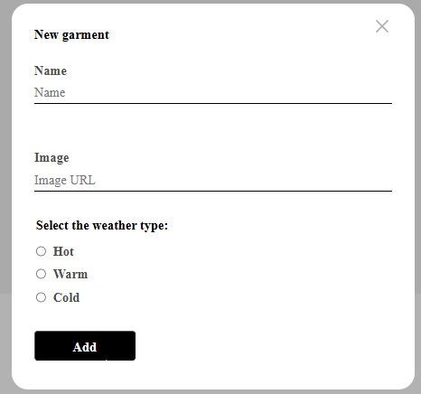
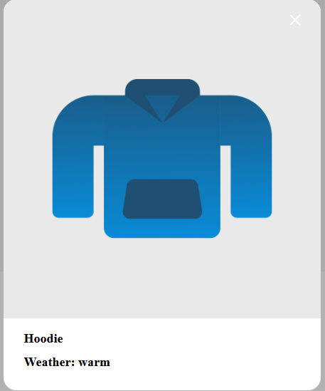

# WTWR - What to Wear : Clothing Suggestion App

## Overview
- Intro
- Technologies & Techniques Utilized
- Link to the Site
- Link to Project Brief

## Intro
WTWR is a clothing suggestion app that provides clothing suggestions based on the current weather. The current version displays a singular temperature option along with a default list of suggestions. Future updates will give users the ability to add clothing, filter suggestions, and adjust temperatures.

## Technologies & Techniques Utilized
The current version of WTWR utilizes basic technologies & techniques to display the starting structure of the app. The following languages were used: React, Javascript, HTML, & CSS.

### In the header

The currrent date is displayed using the Date() object.

The "+Add clothes" button is responsive and opens a clothing form which will be made functionional in later versions.

The current version has a hard coded location, username, and user photo. User customization will be intergrated in later versions. 

### In the weather card

The main section is a wrapper for the main content of the app component.

The weather card displays the current locations weather in fahrenheit along with an image relevant to the time of day and weather conditions. If it is a warm, stormy night in Memphis, TN, expect to see 75F with an image of a stormy night.

The weather card works with OpenWeather API to display accurate weather information based.

### In the item card

The item cards are displayed through a filtering system and also uses the OpenWeather API to determine weather onditions. If the weather is warm, expect to see a hoodie.

When an item card is clicked, a preview modal opens up.

## Link to the Site

[View the site on Github pages](https://acozycoder.github.io/se_project_react/)

## Link to the Prject Brief

[Project Brief](https://www.figma.com/design/F03bTb81Pw8IDPj5Y9rc5i/Sprint-10-%7C-WTWR)